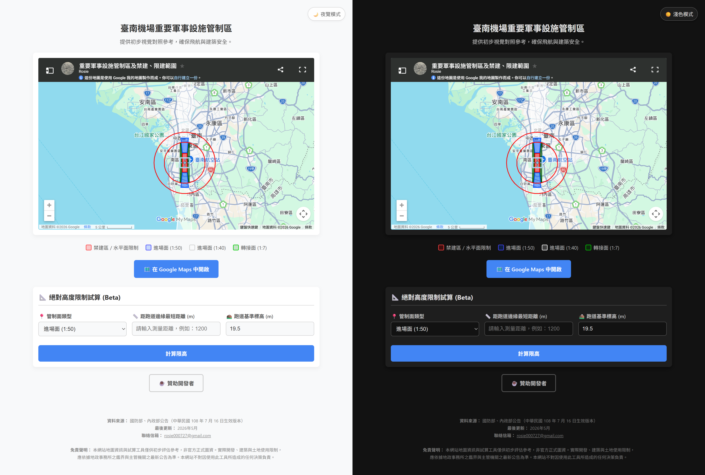

# 臺南機場飛安管制區查詢系統 ✈️

這是一個專為查詢「臺南機場（RCNN）重要軍事設施管制區」所開發的輕量化視覺化與試算工具。透過整合 Google Maps 圖資與前端試算邏輯，提供使用者與開發者初步的飛航、建築與土地使用限制參考。

## ✨ 核心功能 (Features)

* **🗺️ 互動式視覺圖資**：整合禁建區、進場面 (1:50 / 1:40) 與轉接面 (1:7) 的精準範圍對照。
* **📐 絕對高度限制試算**：內建法規運算公式，輸入距跑道邊緣最短距離與基準標高，即可快速評估建築限高。
* **🌙 沉浸式夜覽模式**：支援系統級的暗色主題切換，並透過 `localStorage` 記憶使用者偏好，降低低光源環境下的視覺疲勞。
* **📱 響應式設計 (RWD)**：完美適配桌機與行動裝置，確保在手機端也能擁有流暢的單手操作體驗。

## 📸 畫面展示 (Screenshots)

## 🛠️ 技術堆疊 (Tech Stack)

本專案採用極簡的前端架構，無須依賴龐大的框架，確保載入速度與維護的便利性：
* **HTML5** (語意化結構)
* **CSS3** (CSS Variables 實作主題切換、Flexbox 排版)
* **Vanilla JavaScript** (DOM 操作、限高邏輯運算)
* **Google My Maps** (圖資嵌入)

## 🚀 部署與執行 (Deployment)

本專案為純靜態網頁，已透過 GitHub Pages 自動部署上線。
👉 **[點此造訪網站](https://u95306.github.io/你的Repository名稱/)**

## ⚠️ 免責聲明 (Disclaimer)

本網站地圖資訊與試算工具僅供「初步評估參考」，非官方正式圖資。實際開發、建築與土地使用限制，應依據地政事務所之鑑界與主管機關（國防部、內政部）之最新公告為準。本網站不對因使用此工具所造成的任何決策負責。

## 📫 聯絡與支持 (Contact & Support)

* **聯絡信箱**：[rosie000727@gmail.com](mailto:rosie000727@gmail.com)
* 如果這個小工具對你有幫助，歡迎 **[☕ 贊助開發者 (PayPal)](https://paypal.me/YSStudioTW)**，支持伺服器與後續維護運作！

## 資料來源
- [交通部民用航空局禁限建管制查詢系統](https://web-gis2000.caa.gov.tw/caaPublic/(S(y5rl3rf5dnrpishpnrq1dk5d))/airport.aspx)
### 台南機場
- [公告「臺南機場重要軍事設施管制區」](https://law.mnd.gov.tw/scp/Query2k.aspx?no=EF00000,%E5%9C%8B%E4%BD%9C%E8%81%AF%E6%88%B0,1080001226,20190626)
- [禁限建範圍示意圖；免查詢區域](https://www.tnaa.org.tw/RegulationIframe/471)
